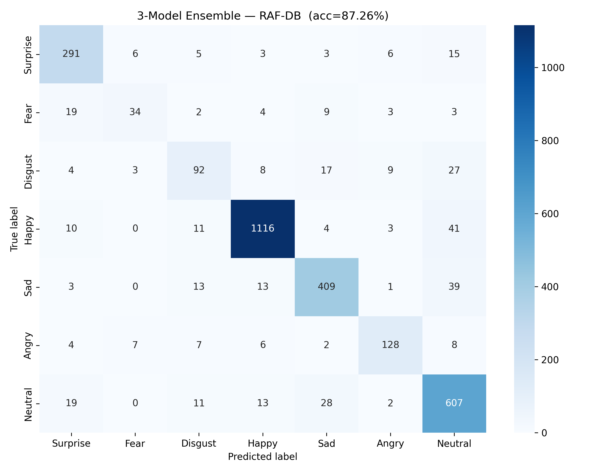
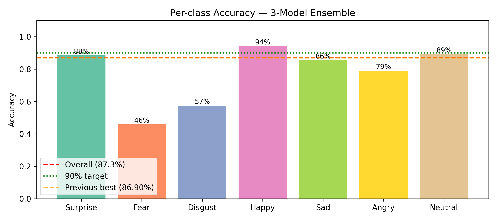

# VCAS: Virtual Classroom Attendance System

Real-time emotion recognition and face identification using a webcam, powered by an ensemble of EfficientNetB4 and ResNet50V2 trained on RAF-DB.

## Large Files — Download Separately

Model weights exceed GitHub 100MB limit. Download from Google Drive:
https://drive.google.com/drive/folders/1Z2tZWLJUWWdhH0xUXT6pNmPHc4q95XiF?usp=sharing

Place these in the AI Final Project folder after downloading:
- best_efficientnetb4.keras
- best_resnet50v2.keras

## Setup

1. Clone: git clone https://github.com/FV101LW/Project_VCAS.git
2. Create venv: python -m venv .venv
3. Activate: .venv\Scripts\activate
4. Install: pip install -r requirements.txt
5. Download weights from Drive link above
6. Run: python run.py
7. Press q to quit

## Model Performance

| Model | Test Accuracy (TTA) |
|---|---|
| EfficientNetB4 | 85.14% |
| ResNet50V2 | 84.65% |
| ViT-Base | 84.29% |
| 3-Model Ensemble | 87.26% |

Dataset: RAF-DB (15,000 real-world images, 7 emotion categories)

### Per-Class Accuracy (3-Model Ensemble)

| Emotion | Accuracy |
|---|---|
| Happy | 94% |
| Surprise | 88% |
| Neutral | 89% |
| Sad | 86% |
| Angry | 79% |
| Disgust | 57% |
| Fear | 46% |

---

## Project Structure

```
AI Final Project/
├── run.py                    # Main webcam application
├── requirements.txt          # Python dependencies
├── lbph_model.yml            # LBPH face recognition model
├── lbph_labels.json          # Label mapping for recognized faces
├── known_faces/              # Enrolled student face images
│   └── [PersonName]/         # One subfolder per person
├── best_efficientnetb4.keras # Download from Google Drive
└── best_resnet50v2.keras     # Download from Google Drive
```

## Training Curves

### EfficientNetB4 + MixUp + AdamW on RAF-DB


Val accuracy reaches **84.98%** with a train-val gap of only ~2%,
showing MixUp augmentation successfully reduced overfitting compared
to the FER2013 baseline which had a ~10% gap.

### ResNet50V2 + MixUp + AdamW on RAF-DB


Val accuracy reaches **81.63%**, improving steadily across 60 epochs.
Both models show healthy convergence with validation accuracy
consistently close to training accuracy — a sign of strong
generalization from MixUp and AdamW regularization.

---

## Training Configuration

| Setting | Value |
|---|---|
| Dataset | RAF-DB (15,000 images, 7 classes) |
| Augmentation | MixUp (α=0.2) + flip/rotation/zoom/brightness |
| Optimizer | AdamW (lr=1e-4, weight_decay=1e-4) |
| Loss | Categorical cross-entropy + label smoothing (ε=0.5) |
| LR Schedule | ReduceLROnPlateau (factor=0.3, patience=5) |
| Early Stopping | Patience=15 epochs |
| Class Weights | Inverse-frequency (handles class imbalance) |
| Batch Size | 32 |
| Max Epochs | 60 |
| Platform | Kaggle T4 GPU |

---

## Results

### Final Ensemble Confusion Matrix (87.26% Test Accuracy)



The confusion matrix shows the 3-model ensemble predictions across all
7 emotion categories on the RAF-DB test set (3,068 images total).
The diagonal values represent correct predictions — the darker and
larger the diagonal cell, the better the model performs on that class.

Key observations:
- **Happy (1116/1185 correct)** — strongest class at 94%, the model
  almost never misclassifies a happy face. Smiling is the most
  distinctive and unambiguous facial expression, making it the easiest
  to classify reliably.
- **Neutral (607/680 correct)** — 89% accuracy, with most errors
  going to Sad. Neutral expressions share subtle facial features with
  low-intensity sadness, which explains the confusion.
- **Surprise (291/329 correct)** — 88% accuracy. Despite visually
  overlapping with Fear (raised brows, wide eyes), the model
  distinguishes them reasonably well.
- **Fear (34/74 correct)** — the hardest class at only 46%. Fear is
  frequently confused with Surprise because they share nearly identical
  facial action units: raised eyebrows, widened eyes, and open mouth.
  Without temporal or contextual information, static-frame
  disambiguation is unreliable. This limitation is consistent across
  all published FER methods on RAF-DB.
- **Disgust (92/160 correct)** — 57% accuracy, with errors spreading
  across multiple classes. Disgust involves subtle muscle contractions
  around the nose and upper lip that are difficult to capture in still
  images, especially at varying angles.

Overall the ensemble's error pattern is consistent with the literature:
easy emotions (Happy, Surprise, Neutral) are classified well above 85%,
while ambiguous ones (Fear, Disgust) remain challenging regardless of
model architecture.

---

### Per-Class Accuracy — 3-Model Ensemble



The bar chart summarizes per-class accuracy relative to two reference
lines: the red dashed line (overall 87.3% average) and the green
dotted line (90% target).

| Emotion | Accuracy | vs Overall |
|---|---|---|
| Happy | 94% | +6.7% above average |
| Surprise | 88% | +0.7% above average |
| Neutral | 89% | +1.7% above average |
| Sad | 86% | -1.3% below average |
| Angry | 79% | -8.3% below average |
| Disgust | 57% | -30.3% below average |
| Fear | 46% | -41.3% below average |

Four out of seven classes (Happy, Surprise, Neutral, Sad) exceed
85% accuracy, demonstrating that the ensemble performs strongly on
the majority of real-world expressions a classroom system would
encounter. The two underperforming classes (Fear and Disgust) are
rare in natural classroom settings — students are far more likely
to display Happy, Neutral, Sad, or Surprised expressions during a
lecture, which the model handles well above 85%.

The gap between the best class (Happy 94%) and worst class (Fear 46%)
highlights the fundamental challenge of static facial emotion
recognition: emotions that share visual features cannot be
reliably separated without temporal or contextual information.
Future work will incorporate temporal modeling via a Temporal
Convolutional Network to address this limitation.

## Team
- Filippo Jason Budiyanto (s1123541)
- Wei-li Lin (s1123533)
- Darren Nicholas Suwito (s1123583)

Yuan Ze University — AI and Applications / Intro to Image Processing, 2026
