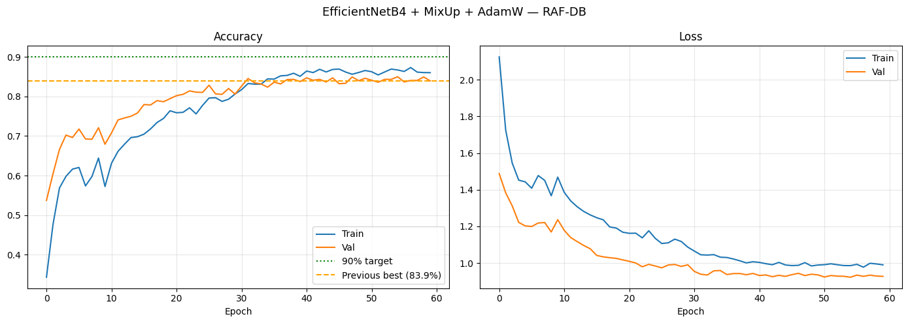
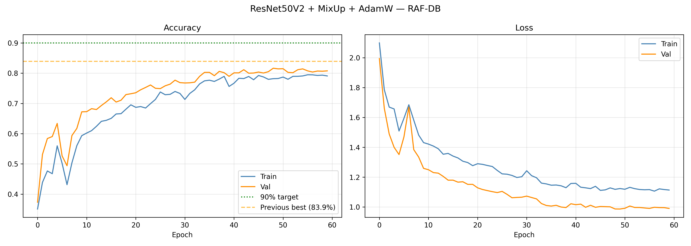

# VCAS: Virtual Classroom Attendance System

Real-time emotion recognition and face identification using a webcam, powered by an ensemble of EfficientNetB4 and ResNet50V2 trained on RAF-DB.

## Large Files — Download Separately

Model weights exceed GitHub 100MB limit. Download from Google Drive:
https://drive.google.com/drive/folders/1Z2tZWLJUWWdhH0xUXT6pNmPHc4q95XiF?usp=sharing

Place these in the AI Final Project folder after downloading:
- best_efficientnetb4.keras
- best_resnet50v2.keras

## Setup

1. Clone: git clone https://github.com/FV101LW/Project_VCAS.git
2. Create venv: python -m venv .venv
3. Activate: .venv\Scripts\activate
4. Install: pip install -r requirements.txt
5. Download weights from Drive link above
6. Run: python run.py
7. Press q to quit

## Model Performance

| Model | Test Accuracy (TTA) |
|---|---|
| EfficientNetB4 | 85.14% |
| ResNet50V2 | 84.65% |
| ViT-Base | 84.29% |
| 3-Model Ensemble | 87.26% |

Dataset: RAF-DB (15,000 real-world images, 7 emotion categories)

### Per-Class Accuracy (3-Model Ensemble)

| Emotion | Accuracy |
|---|---|
| Happy | 94% |
| Surprise | 88% |
| Neutral | 89% |
| Sad | 86% |
| Angry | 79% |
| Disgust | 57% |
| Fear | 46% |

---

## Training Curves

### EfficientNetB4 + MixUp + AdamW on RAF-DB

Val accuracy reaches **84.98%** with a train-val gap of only ~2%,
showing MixUp augmentation successfully reduced overfitting compared
to the FER2013 baseline which had a ~10% gap.

### ResNet50V2 + MixUp + AdamW on RAF-DB

Val accuracy reaches **81.63%**, improving steadily across 60 epochs.
Both models show healthy convergence with validation accuracy
consistently close to training accuracy — a sign of strong
generalization from MixUp and AdamW regularization.

---

## Training Configuration

| Setting | Value |
|---|---|
| Dataset | RAF-DB (15,000 images, 7 classes) |
| Augmentation | MixUp (α=0.2) + flip/rotation/zoom/brightness |
| Optimizer | AdamW (lr=1e-4, weight_decay=1e-4) |
| Loss | Categorical cross-entropy + label smoothing (ε=0.5) |
| LR Schedule | ReduceLROnPlateau (factor=0.3, patience=5) |
| Early Stopping | Patience=15 epochs |
| Class Weights | Inverse-frequency (handles class imbalance) |
| Batch Size | 32 |
| Max Epochs | 60 |
| Platform | Kaggle T4 GPU |

---
## Team
- Filippo Jason Budiyanto (s1123541)
- Wei-li Lin (s1123533)
- Darren Nicholas Suwito (s1123583)

Yuan Ze University — AI and Applications / Intro to Image Processing, 2026
